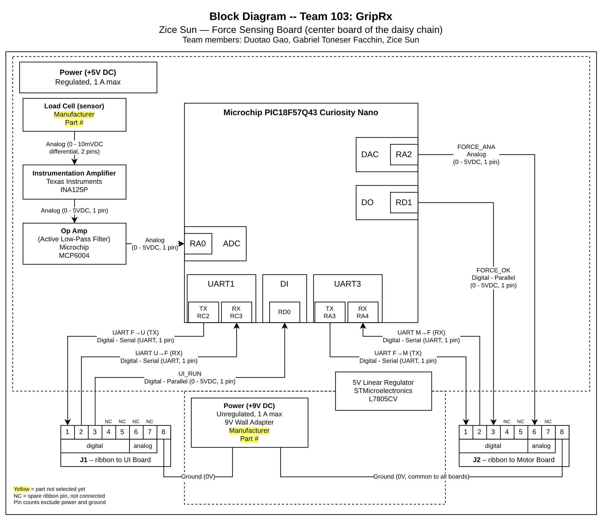

<!-- SKELETON for Duotao Gao. Replace every [FILL ...] and delete these
     HTML comments when done. Pin tables below are copied from the team
     page (Table 2) and must stay identical to it. -->

# Block Diagram: User Interface Board

**Duotao Gao** · Team 103 (Duotao Gao, Gabriel Toneser Facchin, Zice Sun) · Project: **GripRx**, a prescription-based automatic-resistance grip trainer

## Overview

<!-- 1 short paragraph + 4 bullets. Say what the page is for, then cover:
     role in the system, actuator, inputs/display, power. -->

[FILL: one or two sentences on what this page shows and why the block diagram matters, e.g. it fixes which peripherals and pins you use before component selection and the schematic.]

- **Role in the system.** [FILL: the UI board is one end of the team's daisy chain; it reads the buttons, drives the display, plays sound feedback, and talks to the force sensing board (Zice Sun) on ribbon connector J1.]
- **Actuator.** [FILL: the speaker is driven from DAC1 (RA2) through an active low-pass filter (op amp) and an audio amplifier; each stage is a separate block.]
- **Inputs and display.** [FILL: three push buttons (START/STOP, UP, DOWN) on digital inputs RD1–RD3; a character LCD on six digital outputs (RE0, RE1, RD4–RD7).]
- **Power.** [FILL: 9 V unregulated wall adapter → 5 V linear regulator → every part on the board; no power over the ribbon, pin 8 only shares ground.]

## Block Diagram

**Figure 1.** Individual block diagram of the user interface board. Arrows show signal direction; parts highlighted in yellow have not been selected yet.

The editable source of Figure 1 is available as a [draw.io file](block-diagram.drawio).

## Microcontroller Peripherals and Pins

**Table 1.** PIC18F57Q43 Curiosity Nano peripherals used on the user interface board.

| Peripheral | Type | Pin | Signal | Direction | Connects to |
|---|---|---|---|---|---|
| Digital input | DI | RD1 | START/STOP button | In | START/STOP button |
| Digital input | DI | RD2 | UP button | In | UP button |
| Digital input | DI | RD3 | DOWN button | In | DOWN button |
| Digital output | DO | RE0, RE1, RD4–RD7 | LCD control and data (6 pins) | Out | Character LCD |
| DAC1 | DAC | RA2 | Audio signal | Out | Op amp low-pass filter |
| UART1 | UART | RC3 (RX) | UART F→U | In | J1 pin 1 ← force board |
| UART1 | UART | RC2 (TX) | UART U→F | Out | J1 pin 2 → force board |
| Digital output | DO | RD0 | UI_RUN | Out | J1 pin 3 → force board |

## Ribbon Cable Connector

The connector follows the class standard (pins 1–5 digital, pins 6–7 analog, pin 8 ground) and matches the team block diagram.

**Table 2.** Connector J1: user interface board to force sensing board.

| Pin | Type | Signal | Direction | My pin |
|---|---|---|---|---|
| 1 | Digital | UART F→U | Force → UI | RC3 (U1RX) |
| 2 | Digital | UART U→F | UI → Force | RC2 (U1TX) |
| 3 | Digital | UI_RUN | UI → Force | RD0 (DO) |
| 4–5 | Digital | Not connected | — | — |
| 6–7 | Analog | Not connected | — | — |
| 8 | Ground | Common ground | — | GND |

## Power Supplies

**Table 3.** Power rails on the user interface board.

| Rail | Source | Regulated | Max current | Powers |
|---|---|---|---|---|
| +9 V DC | 9 V wall adapter [FILL part or "not selected yet"] | No | [FILL] A | 5 V regulator input |
| +5 V DC | [FILL manufacturer part #] linear regulator | Yes | [FILL] A | Curiosity Nano, LCD, op amp, audio amplifier |

## Open Items

- [FILL: parts still highlighted in yellow, to be selected during component selection.]

## Use of Generative AI

<!-- Keep this section only if you used AI. Describe honestly what it did and paste your query text. -->

[FILL]
